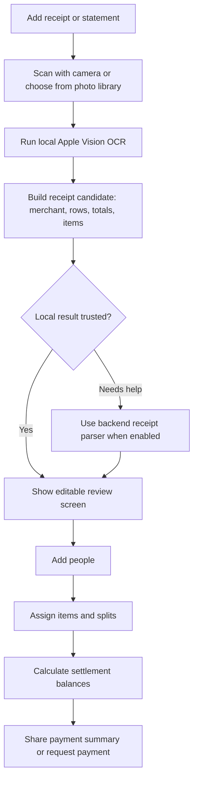
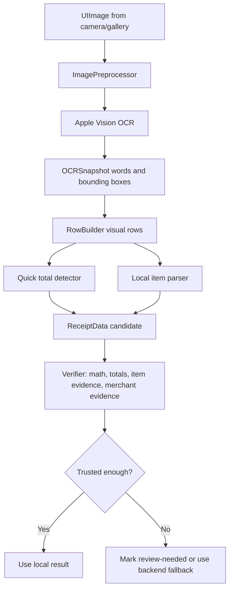
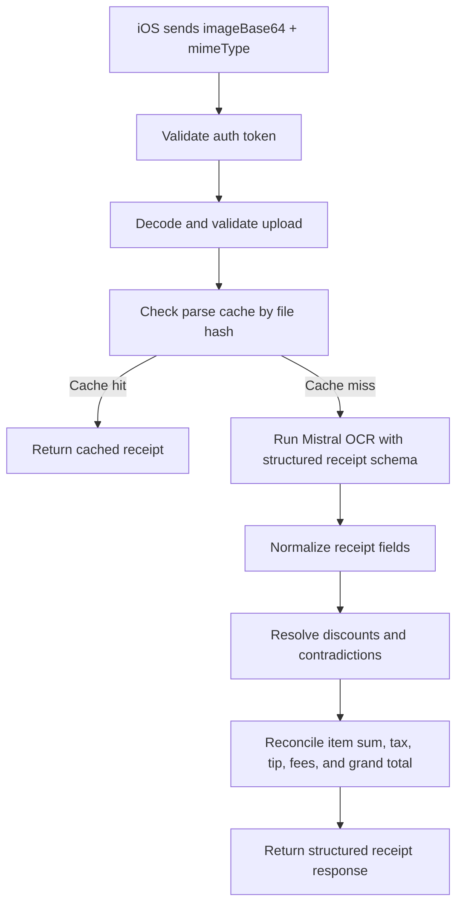
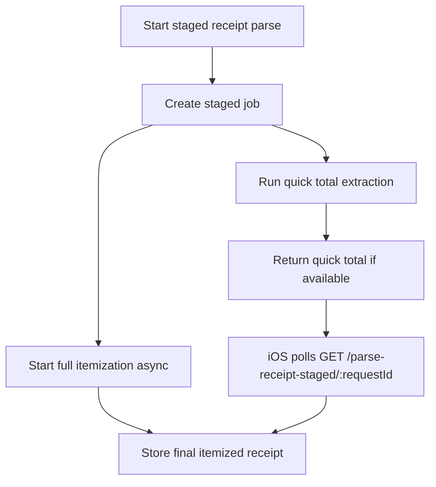
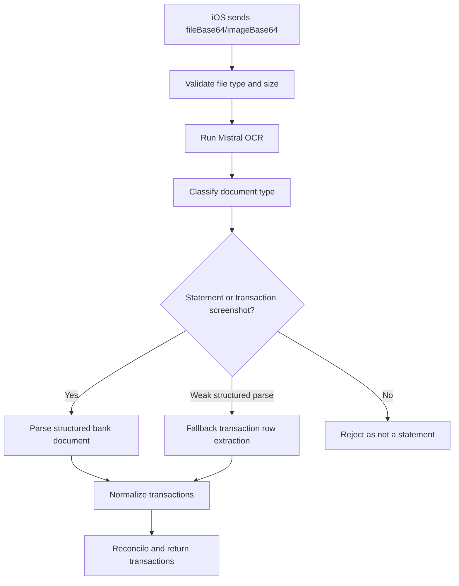

# Dutch

Dutch is an iOS bill-splitting app built around a receipt-first workflow: scan a receipt, review the parsed items, assign who shared each item, and settle balances with friends.

The app is designed for real social spending: restaurants, groceries, shared trips, household purchases, group payments, and receipts that are messy enough to need human review. The core product goal is not only to read totals, but to turn a real receipt into editable split-ready transaction data.

## Preview

Add your main product image here after you place it in the repo:

```md

```

Recommended image path:

```text
docs/images/dutch-preview.jpg
```

## What Dutch Does

Dutch helps a group answer four questions quickly:

1. What was bought?
2. Who participated?
3. Who shared each item?
4. Who needs to pay whom?

The app supports both fast automatic scanning and manual correction because receipt OCR is never perfect in the real world. A strong workflow matters more than pretending OCR is magic.

## Product Workflow



## Main Features

- Receipt capture from camera
- Receipt import from photo library
- Local Apple Vision OCR for fast on-device parsing
- Receipt preprocessing and OCR quality diagnostics
- Merchant, total, subtotal, tax, tip, fee, and item extraction
- Review screen for correcting OCR output before finalizing
- Manual item entry when OCR misses something
- Group-based splitting
- Per-item participant assignment
- Balance and settlement calculation
- Venmo and Zelle profile/payment setup
- Shareable settlement summaries
- Statement and transaction screenshot parsing through the backend

## iOS App Architecture

The iOS app is a SwiftUI app. The visible app/workspace name is `Dutch`, while some internal folders and target names still use `Dutchi`.

Important app areas:

```text
Dutchi/App/                       App entry, router, global app state
Dutchi/Features/Upload/           Receipt/statement upload and camera flow
Dutchi/Features/Review/           Transaction review and split assignment
Dutchi/Features/People/           People selection and group participants
Dutchi/Features/SettleShare/      Settlement output and sharing
Dutchi/Features/Profile/          User profile and payment setup
Dutchi/Services/OCRService.swift  Main local OCR and parser pipeline
Dutchi/Services/ReceiptPreprocessing/
                                  Receipt image preprocessing helpers
Dutchi/Models/                    Transaction, person, profile, balance models
DutchiShareExtension/             iOS share extension
receipt-backend/                  Node backend for Mistral OCR parsing
```

## Receipt OCR Workflow

Dutch has two receipt parsing layers:

1. Local iOS OCR using Apple Vision.
2. Optional backend parsing using Mistral OCR when a server route is enabled.

The local path is the first line of defense because it is fast, private, and works directly after camera/gallery confirmation.



### Local OCR Responsibilities

The iOS OCR pipeline is responsible for:

- Running Apple Vision text recognition.
- Preserving word geometry.
- Grouping recognized words into visual rows.
- Detecting totals, subtotal, tax, tips, fees, discounts, and item prices.
- Separating item rows from summary/payment/footer rows.
- Building local `ReceiptData`.
- Scoring whether the result is trustworthy.
- Avoiding hard crashes when Vision or preprocessing fails.

The local parser should never make bad OCR look final. If the receipt total is visible but itemization is weak, the app can still show a total-only or review-required result instead of silently creating fake items.

## Backend: `receipt-backend`

The backend is a Node/Express service that provides higher-accuracy parsing for receipts, financial statements, and transaction screenshots.

Backend entry point:

```text
receipt-backend/server.js
```

Backend package:

```text
receipt-backend/package.json
```

Runtime:

```text
Node 22.x
```

Core backend dependencies:

- Express
- Mistral SDK
- Zod
- dotenv
- CORS

### Backend Environment

The backend reads configuration from `receipt-backend/.env`. Do not commit real secret values.

Required categories:

```text
APP_BEARER_TOKEN       App-to-backend bearer token
MISTRAL_API_KEY        Mistral API key for OCR/document parsing
PORT                   Optional local port, defaults to 3001
ADMIN_BEARER_TOKEN     Optional admin analytics token
```

Useful optional settings:

```text
MISTRAL_OCR_MODEL
MISTRAL_OCR_TIMEOUT_MS
QUICK_TOTAL_TIMEOUT_MS
MAX_UPLOAD_BYTES
MAX_PDF_PAGES
SAVE_TEMP_RECEIPTS
ENABLE_DEBUG_RESPONSE
ANALYTICS_RETENTION_DAYS
```

### Backend Endpoints

The backend exposes these main endpoints:

```text
GET  /health
POST /parse-receipt
POST /parse-receipt-staged
GET  /parse-receipt-staged/:requestId
POST /parse-financial-document
POST /normalize-item-names
POST /analytics/events
GET  /admin/analytics
GET  /admin/analytics/summary
GET  /admin/analytics/events
```

### Receipt Backend Flow

`POST /parse-receipt` is the single-pass receipt parser.



`POST /parse-receipt-staged` is optimized for faster perceived feedback. It starts itemization in the background and tries to return a quick total early.



### Financial Document Flow

`POST /parse-financial-document` handles statement PDFs, bank screenshots, and credit card transaction screenshots.



### Analytics

The backend records sanitized analytics events for upload, OCR, parse, rejection, and completion states. Sensitive fields such as raw base64 uploads and OCR text are redacted before analytics storage.

Analytics is useful for understanding:

- OCR success rate
- Receipt parse success rate
- Statement parse success rate
- Common failure reasons
- Processing time
- File type distribution
- Low confidence routes

## Running the iOS App

Open the workspace:

```bash
cd /Users/taehoonkang/Desktop/Projects/Dutch
open Dutch.xcworkspace
```

Use the scheme:

```text
Dutch
```

Build from terminal:

```bash
xcodebuild -workspace Dutch.xcworkspace -scheme Dutch -destination 'generic/platform=iOS Simulator' CODE_SIGNING_ALLOWED=NO build
```

## Running the Backend Locally

From the repo root:

```bash
cd receipt-backend
npm install
npm start
```

Health check:

```bash
curl http://localhost:3001/health
```

Run backend tests:

```bash
cd receipt-backend
npm test
```

The iOS app reads the backend URL from `ReceiptParserEndpoint` in the app configuration. For local device testing, use a reachable network URL instead of `localhost` if the app runs on a physical iPhone.

## How to Add Images to This README

Use this structure:

```text
docs/
└── images/
    ├── dutch-preview.jpg
    ├── upload-flow.png
    └── receipt-review.png
```

Steps:

1. Create the image folder:

   ```bash
   mkdir -p docs/images
   ```

2. Copy your screenshot/design image into that folder.

   Example:

   ```bash
   cp ~/Downloads/Payment\ Finance\ App\ Design.jpg docs/images/dutch-preview.jpg
   ```

3. Reference it in Markdown:

   ```md
   
   ```

4. Commit the image with the README:

   ```bash
   git add README.md docs/images/dutch-preview.jpg
   git commit -m "Add README preview image"
   git push
   ```

GitHub will render the image automatically as long as the file is committed and the path matches exactly.

## Suggested README Images

Good images to include:

- A wide hero image showing several Dutch screens.
- Upload screen with receipt scan options.
- Receipt review screen with item assignment.
- Settlement screen showing who owes whom.
- Profile/payment setup screen.

Recommended sizes:

```text
Hero image:     1600x900 or 1800x1000
Phone mockups:  PNG or JPG
File size:      Keep under 2 MB when possible
```

## GitHub

Remote repository:

```text
https://github.com/thkang091/Dutch.git
```

Commit and push:

```bash
git add -A
git commit -m "Update README"
git push
```
